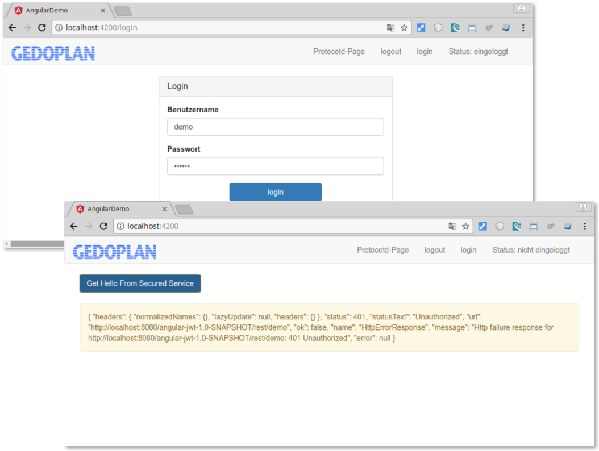

# JWT Demo Java EE + Angular 

## Java EE

- Login / Logout per Rest+JWT
- Generierung JWT Tokens
- Beispiel Rest-Schnittstellen
- JJWT

## Angular

- Login / Logout
- Demo Calls
- Guards
- @auth0/angular-jwt

